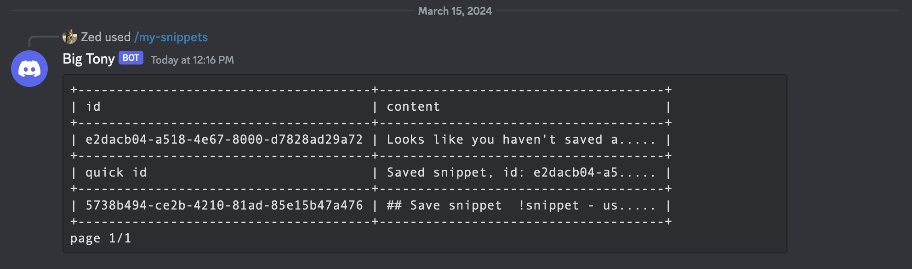
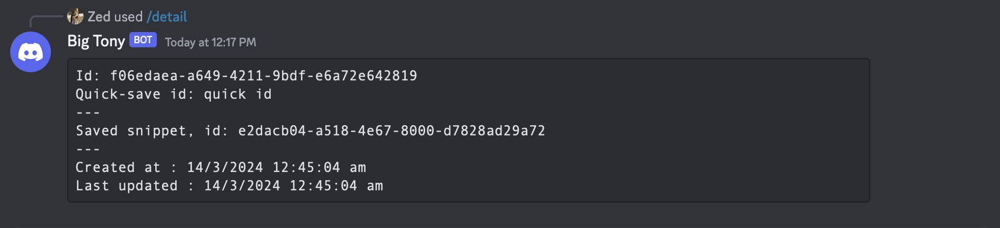
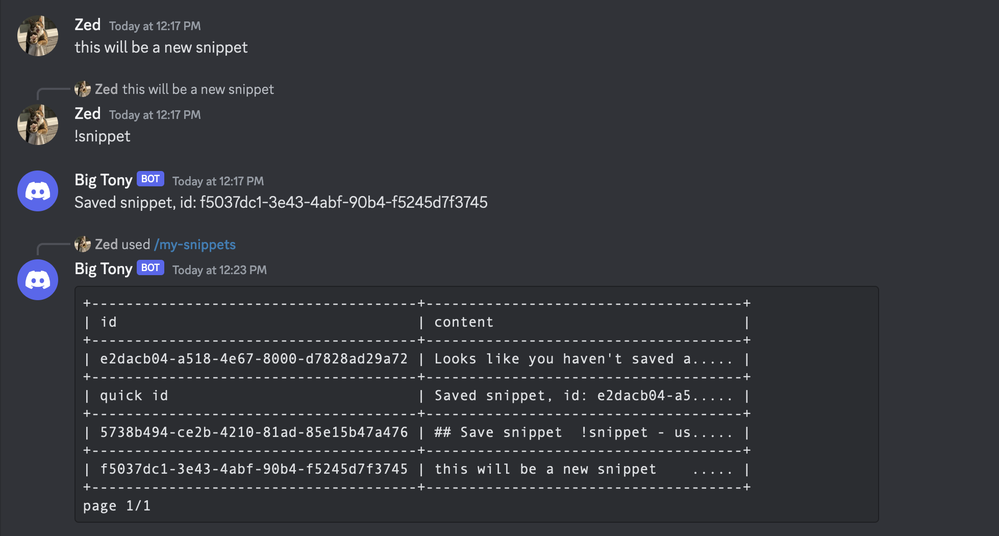

# AusDevs Bot

This is my entry to the AusDevs discord bot hackathon/competition

This bot is designed around the need of saving code snippets for later use.

The bot is developed with C# and the Discord.NET library and makes use of Sqlite for a database

## Running the bot
- first create the .env file: `cp .env.example .env`
- create a discord bot and generate the token ((see this article for how to do that)[https://www.writebots.com/discord-bot-token/])
  - **Important**: make sure you check the `bot` and `application.commands` scopes when creating the oauth url for the bot
  - **Important**: make sure to check the `Read Messages`, `Send Messages`, `Manage Messages` and `Use Slash Commands` permissions
  - **Important**: make sure you have enabled the message content privileged intent

## Improvements
There are a lot of improvements that can be added to this bot
- Support programming languages (already added to the model just not implemented)
- download snippet as a file (json/xml/text)
- remove the duplicated logic between each command for finding a snippet by guid/quick-save id

## Functionality

### Save snippet
- `!snippet` - used in reply to a post, allows you to snippet a whole post
- `/snippet {snippet} {optional quick tag}`

### Fetch Snippets
- `/my-snippets {page number}` - displays snippets with paging parameter
- `/detail {id}` - prints the entire snippet with the corresponding id

### Stats
- `/snippet-stats` - displays snippet stats

### Edit
- `/rename {id} {new id}` - updates the quicksave id for a snippet
- `/set-content {id} {new content}` - updates the snippet content
- `!set-content {id}` - updates the content of the snippet with the corresponding id with the content in the replied message

### Delete
- `/delete {id}` - delete the snippet with the corresponding id

## Images

some images of the bot in action

### Viewing snippets

### Snippet detail

### Save a snippet

### View your snippet stats

